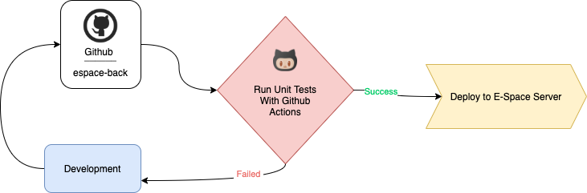

<div style="display:flex; align-items: center">
  
  <h1 style="position:relative; top: -6px" >E Space Mobile App</h1>
</div>

---
E Space Mobile App helps people to find e-car charger nearby and charge their electric cars easily.
E Space also gives opportunity to business with giving them **Business Module** that gives people opportunity to have their own chargers and to make use of **Business Module** service to manage those chargers: create tariffs, monitor them, have analytical dashboard and more...

#
### Table of Contents
* [Prerequisites](#prerequisites)
* [Tech Stack](#tech-stack)
* [Getting Started](#getting-started)
* [Migrations](#migration)
* [Development](#development)
* [Deployment with CI / CD](#deployment-with-ci-\-cd)
* [Project Structure](#project-structure)
* [Service Interaction Map](#service-interaction-map)
* [Server Infrastructure](#server-infrastructure)
* [Database Backups](#database-backups)

#
### Prerequisites

*  *PHP@7.2 and up*
*  *MYSQL@8 and up*
*  *npm@6 and up*
*  *composer@2 and up*


#
### Tech Stack

*  [Laravel@6.x](https://laravel.com/docs/6.x) - back-end framework
*  [Laravel Nova](https://nova.laravel.com/) - flexible Admin Panel as espace "Super Admin"
*  [Laravel Mix](https://laravel-mix.com/) - is a webpack wrapper which makes an ease for a developer to start working on JS files and compile them with such simplicity...
*  [JWT Auth](https://jwt-auth.readthedocs.io/en/develop/) - Authentication system for mobile users
*  [Spatie Translatable](https://github.com/spatie/laravel-translatable) - package for translation

#
### Getting Started
1\. First of all you need to clone E Space repository from github:
```sh
git clone https://github.com/Chkhikvadze/espace-back.git
```

2\. Next step requires you to run *composer install* in order to install all the dependencies.
```sh
composer install
```

3\. after you have installed all the PHP dependencies, it's time to install all the JS dependencies:
```sh
npm install
```

and also:
```sh
npm run dev
```
in order to build your JS/SaaS resources.

4\. Now we need to set our env file. Go to the root of your project and execute this command.
```sh
cp .env.example .env
```
And now you should provide **.env** file all the necessary environment variables:

#
**MYSQL:**
>DB_CONNECTION=mysql

>DB_HOST=127.0.0.1

>DB_PORT=3306

>DB_DATABASE=*****

>DB_USERNAME=*****

>DB_PASSWORD=*****

#
**MAILGUN:**
>MAILGUN_DOMAIN=******

>MAILGUN_SECRET=******

#
**Georgian Card:**
>MERCHANT_ID=******

>PAGE_ID=******

>ACCOUNT_ID=******

>BACK_URL_S=******

>BACK_URL_F=******

>REFUND_API_PASS=******

>CCY=******

#
**Twilio:**
>TWILIO_SID=******

>TWILIO_TOKEN=******

>TWILIO_FROM=******

#
**Maradit:**
>MARADIT_HTTPS=true

>MARADIT_USERNAME=******

>MARADIT_PASSWORD=******

#
**Google Cloud Messaging:**
>FCM_SERVER_KEY=******

>FCM_SENDER_ID=******

after setting up **.env** file, execute:
```sh
php artisan config:cache
```
in order to cache environment variables.

4\. Now execute in the root of you project following:
```sh
  php artisan key:generate
```
Which generates auth key.

##### Now, you should be good to go!


#
### Migration
if you've completed getting started section, then migrating database if fairly simple process, just execute:
```sh
php artisan migrate
```

#
### Running Unit tests
Running unit tests also is very simple process, just type in following command:

```sh
composer test
```

#
### Development

You can run Laravel's built-in development server by executing:

```sh
  php artisan serve
```

when working on JS you may run:

```sh
  npm run dev
```
it builds your js files into executable scripts.
If you want to watch files during development, execute instead:

```sh
  npm run watch
```
it will watch JS files and on change it'll rebuild them, so you don't have to manually build them.


#
### Deployment with CI \ CD
<br/>



<br />

Continues Development / Continues Integration & Deployment steps:
* CI \ CD process first step is of course is development.
* After some time of development when you are ready to integrate and deploy your feature/fix/work you make a commit or pull request to gihub branch.
* That triggers github action which listens to pull requests and commits on development and master branch. Github actions will set up configure project, run unit tests.
* If unit tests fail, you go a head and do some fixing and aftermath try again.
* If unit tests succeed then github actions will deploy your code to development or production server according to the branch you are making commit to.
* After deploying, github actions script will build your code and run migrations all to be up to date.

Then everything should be OK :pray:

#
### Project Structure

```bash
├─── app
│   ├─── Console
│   ├─── Enums
│   ├─── Exceptions
│   ├─── Facades
│   ├─── Http
│   ├─── Library
│   │   ├─── Adapters
│   │   ├─── DataStructures
│   │   ├─── Entities
│   │   ├─── Interactors
│   │   ├─── Presenters
│   │   │___ Testing
│   ├─── Nova
│   ├─── Providers
│   ├─── Traits
│   │___ Rules
│   │... Models
├─── bootstrap
├─── config
├─── database
├─── nova-components
├─── nova
├─── packages
├─── public
├─── resources
├─── routes
├─── scripts
├─── storage
├─── tests
- .env
- artisan
- composer.json
- package.json
- phpunit.xml
```

Project structure is fairly straitforward(at least for laravel developers)...

For more information about project standards, take a look at these docs:
* [Laravel](https://laravel.com/docs/6.x)
* [Nova](https://nova.laravel.com/)

Aside from laravel/nova specific structure here are some of the key points that worth pointing out.

In **app/Library** we have isolated the core project(E Space) functionality concerning heavy calculation, cron jobs and most of the complex procedures that happen on daily bases. 
For more information about task scheduling in Laravel, please take a look:
[Laravel - Task Scheduling](https://laravel.com/docs/6.x/scheduling)

When request hits controller, controller speaks to the one of the **Interactor** in the **app/Library/Interactor** folder, which understand the task and with the help of *Entities* in the **app/Library/Entities** this task is decomposed into several small tasks and each of them is assigned to the entity to take care of.

As a result entities solve decomposed tasks and speak back to the interactor and interactor himself responds to the controller and then controller sends back an appropriate response to the user.

Also:
* **app/Library/Adapters** - wraps third party services(such as Georgian Card Package)
* **app/Library/DataStructures** - help controller/interactor/entity to communicate with data
* **app/Library/Presenters** - Presenters are often used response objects
* **app/Library/Testing** - In testing folder we have custom mockers

[Database Design Diagram](./readme/uml/uml.md "Draw.io")

[Swagger API endpoints](https://app.swaggerhub.com/apis-docs/E-space/EspaceAPI/1.0.3 "API")

#
### Service Interaction Map
 
<br />

As stated above E Space Application consists of several parties which are closely connected with each other.
Application is hosted in AWS Cloud, which consists of several services:
* **ECS Server** which holds E-Space Codebase, that itself consists of several modules: 
  * ***Super Admin Nova*** - gives ability to the E-Space HQ to have control over everything. 
  * ***Business Module*** - is created for people who would like to purchase charger or/and services from E-Space and with Business Module one can control, watch and have analytical reports about his/her own chargers. Also ability to create/remove tariffs and to have transactions listing.
  * ***Mobile Application Back-End & API*** - is means to utilize mobile app. within this module all the charging calculation and heavy lifting is done, including talking to ***Charger Device Server***
* ***AWS EBS***
* ***AWS RDS***
* ***AWS Elastic IP***
* ***Charger Device Server*** - is another party acting as middleware between Application Back-End and Charger Devices.

#
### Server Infrastructure

##### Development Server
For dev server we are using [Laravel Forge](https://forge.laravel.com/docs/1.0/introduction.html#what-is-forge) server management system, which under the hood uses Amazon **EC2** *t2.micro* instance with 20 GiB EBS storage.

##### Production Server
For production server we are using directly **AWS EC2** 
* *t2.medium* instance
* *elastic IP*
* 20 GiB EBS Storage
* RDS - mysql

#
### Database Backups
AWS gives us possibility to automate saving backups. As of now it is configured to save Database Backup for 3 consecutive days. restoring backup is fairly simple.
For more information about RDS Backups, visit official documentation:

[Getting Started with RDS Backups](https://docs.aws.amazon.com/AmazonRDS/latest/UserGuide/CHAP_CommonTasks.BackupRestore.html)